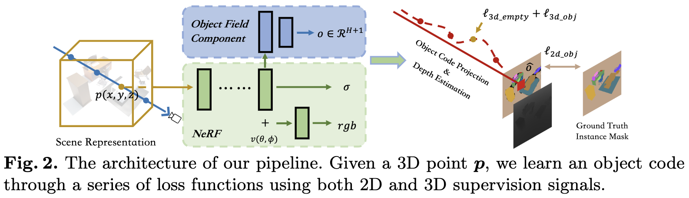
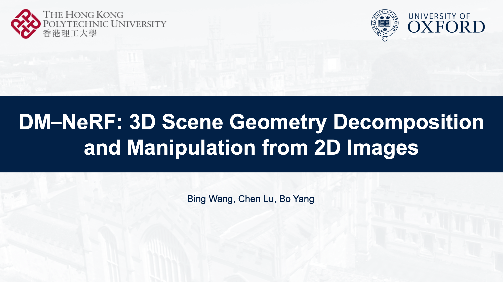

# DM-NeRF: 3D Scene Geometry Decomposition and Manipulation from 2D Images

This is the official repository of the **DM-NeRF**. For technical details, please refer to:

**DM-NeRF: 3D Scene Geometry Decomposition and Manipulation from 2D Images**  
[Bing Wang](https://www.cs.ox.ac.uk/people/bing.wang/), [Lu Chen](https://chenlu-china.github.io/), [Bo Yang*](https://yang7879.github.io/)  
[**Paper**](https://arxiv.org/abs/2208.07227) | [**Video**](https://www.youtube.com/watch?v=yQtpPfM5dTA)

  

## (1) Decomposition and Manipulation:

     &nbsp   

## (2) Qualitative Results

### Scene Decomposition

        
     

### Object Manipulation

#### Rigid Transformation

       
       

#### Deformable Manipulation

       

## (4) Video (Youtube)

  

### Citation
If you find our work useful in your research, please consider citing:

      @article{wang2022dmnerf,
      title={DM-NeRF: 3D Scene Geometry Decomposition and Manipulation from 2D Images},
      author={Bing, Wang and Chen, Lu and Yang, Bo},
      journal={arXiv preprint arXiv:2208.07227},
      year={2022}
    }

### License
Licensed under the CC BY-NC-SA 4.0 license, see [LICENSE](./LICENSE).

### Updates
* 15/8/2022: Initial release！

## Related Repos
1. [GRF: Learning a General Radiance Field for 3D Representation and Rendering](https://github.com/alextrevithick/GRF) 
2. [3D-BoNet: Learning Object Bounding Boxes for 3D Instance Segmentation on Point Clouds](https://github.com/Yang7879/3D-BoNet) 
